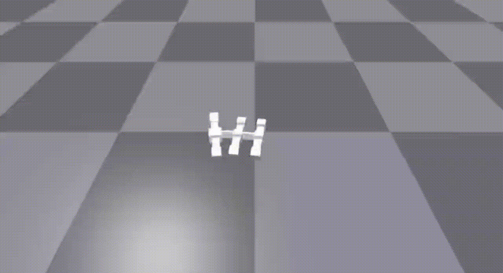

# Robot Locomotion
Collection of learning algorithms for robot locomotion using Revolve2

### To train the robot using the Proximal Policy Optimization (PPO) algorithm:

1. Run rl_optimize.py (optional parameters are --visualize to make the simulation visible and
--from_checkpoint to restart the learning task from a previous checkpoint)
2. Run plot_statistics.py to visualize the mean action reward and state value for each iteration
3. Run rl_rerun_best.py to rerun the last agent

### To train the robot using a Genetic Algorithm (GA):
1. Run ga_optimize.py
2. Run ga_rerun_best.py to rerun the best agent

